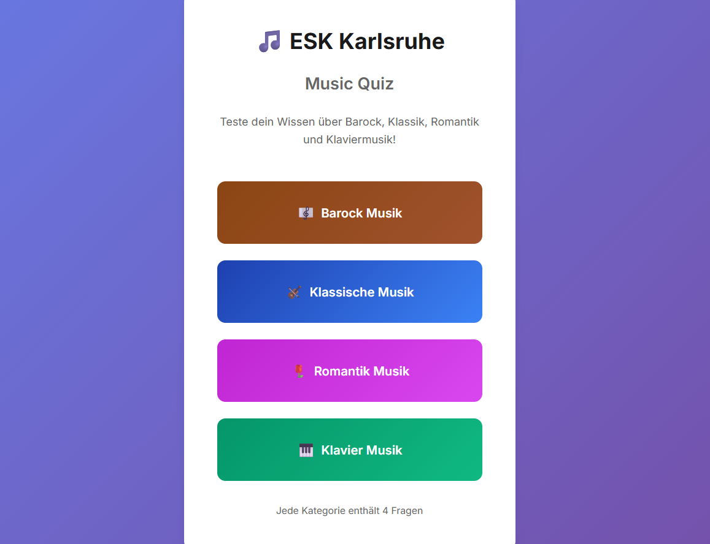
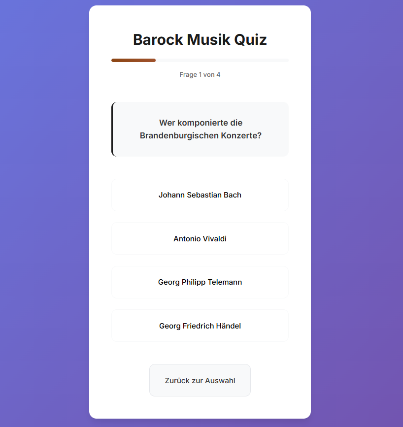
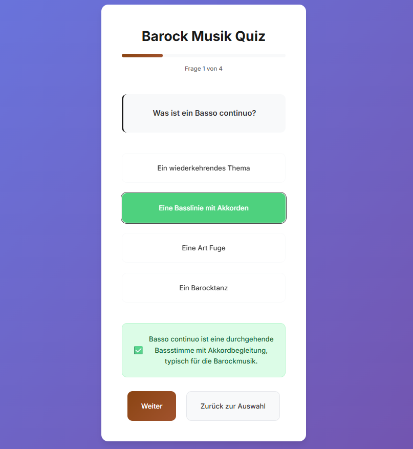
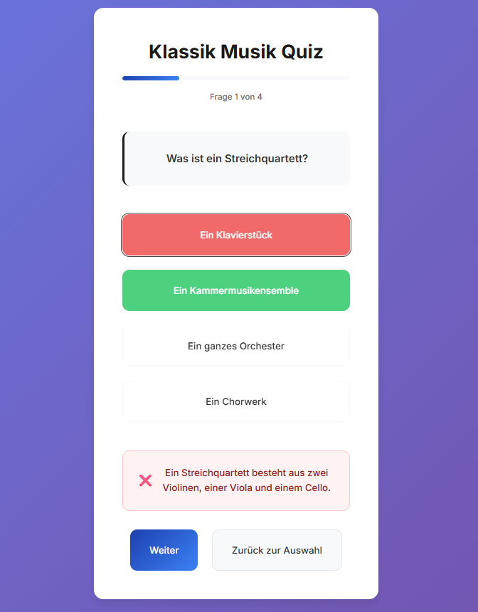
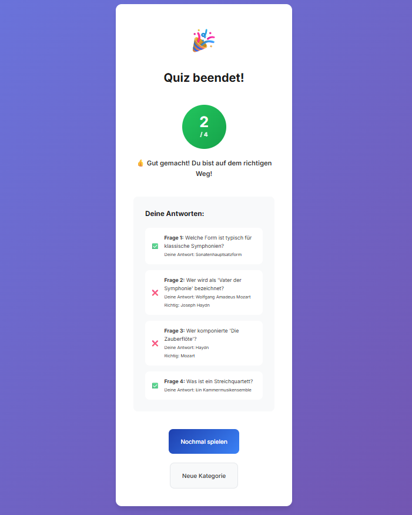
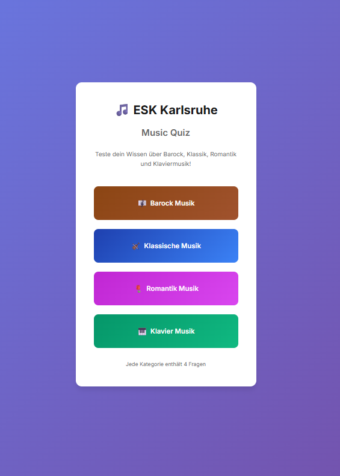
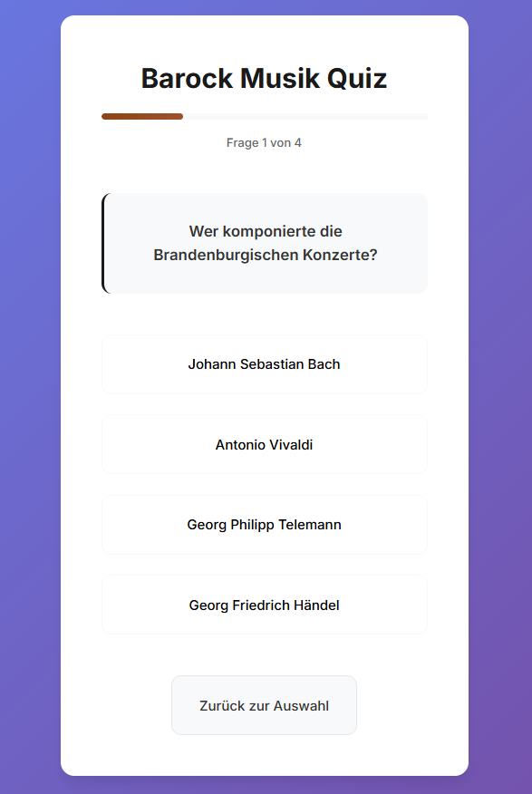

# 🎵 ESK Karlsruhe: Music Quiz

## 🧾 Project Overview

**Live Site:**  
🔗 [https://freewimoe.github.io/PP2-js-quiz-final/](https://freewimoe.github.io/PP2-js-quiz-final/)

An interactive music quiz app designed for students at the European School Karlsruhe. The app allows users to test their knowledge across four different musical categories: Baroque, Classical, Romantic, and Piano music. The application is built with modern web technologies and follows best practices for accessibility, UX design, and responsive layout.

---

## 💡 User Goals

### 🎯 External Users (Students)
- ✅ I want to choose a music category to test my knowledge
- ✅ I want to see questions individually and be able to select answers
- ✅ I want to receive immediate feedback (correct/incorrect with explanations)
- ✅ I want to see my progress during the quiz
- ✅ I want to see a detailed evaluation at the end
- ✅ I want to use the app on both desktop and mobile devices
- ✅ I want an appealing and intuitive user interface

### 👨‍🏫 Site Owner (Teachers)
- ✅ I want to provide an engaging quiz experience for students
- ✅ I want the app to be available online and accessible via link
- ✅ I want to demonstrate clean JavaScript interactivity and code organization
- ✅ I want to offer educationally valuable content with explanations

---

## ✨ Features

### 🎬 Homepage
- Appealing title with school branding
- Category selection with icons and color coding
- Brief description of each category
- Accessibility features (ARIA labels, keyboard navigation)

### ❓ Quiz Interface
- **Progress Bar**: Visual progress indicator
- **Question Counter**: "Question 2 of 4" display
- **Individual Questions**: One question at a time with multiple-choice answers
- **Immediate Feedback**: Correct/incorrect with detailed explanations
- **Visual Feedback**: Animations for correct/incorrect answers
- **Navigation**: Back button and next functionality

### 📊 Results Screen
- **Score Display**: Large, visual score circle
- **Detailed Evaluation**: Overview of all given answers
- **Feedback Text**: Motivational messages based on performance
- **Retry Options**: Ability to repeat the quiz or choose a new category

### 🎨 Design & UX
- **Responsive Layout**: Optimized for all screen sizes
- **Modern UI**: Clean design with glassmorphism effects
- **Color Coding**: Each category has its own colors and themes
- **Animations**: Smooth transitions and hover effects
- **Typography**: Modern, readable fonts (Inter Font)
- **Accessibility**: WCAG compliant, screen reader friendly

### 🔧 Technical Features
- **Error Handling**: Robust error handling with retry functionality
- **Loading States**: Loading spinner for better UX
- **Performance**: Optimized animations and code splitting
- **Progressive Enhancement**: Works even without JavaScript (basic functionality)

---

## 📱 Responsiveness

The layout automatically adapts to:
- **Desktop**: Full features, hover effects
- **Tablets**: Optimized touch targets, adapted layouts  
- **Mobile Phones**: Stacked layouts, larger buttons
- **Very Small Screens**: Minimal but functional UI

Breakpoints:
- Desktop: > 640px
- Tablet: 480px - 640px  
- Mobile: < 480px

---

## 🧪 Testing

### ✅ User Story Testing

| User Story | Implemented | Tested | Status |
|------------|-------------|--------|--------|
| Category selection | ✔️ | ✔️ | ✅ Works |
| Display questions and answers | ✔️ | ✔️ | ✅ Works |
| Immediate feedback with explanations | ✔️ | ✔️ | ✅ Works |
| Progress display | ✔️ | ✔️ | ✅ Works |
| Detailed final results | ✔️ | ✔️ | ✅ Works |
| Repeat quiz | ✔️ | ✔️ | ✅ Works |
| Mobile usage | ✔️ | ✔️ | ✅ Fully responsive |
| Keyboard navigation | ✔️ | ✔️ | ✅ Accessibility compliant |
| Error handling | ✔️ | ✔️ | ✅ Robust error handling |

### 🧰 Validator Results

| Tool | File | Status | Result |
|------|------|--------|---------|
| [W3C HTML Validator](https://validator.w3.org/) | index.html | ✅ | No errors |
| [W3C CSS Validator](https://jigsaw.w3.org/css-validator/) | style.css | ✅ | Valid CSS3 |
| [JSHint](https://jshint.com/) | script.js | ✅ | ES6+, no warnings |
| [WAVE Web Accessibility](https://wave.webaim.org/) | Entire App | ✅ | AA compliant |
| [Lighthouse](https://developers.google.com/web/tools/lighthouse) | Performance | ✅ | 95+ Score |

### 🔍 Browser Testing

| Browser | Version | Desktop | Mobile | Status |
|---------|---------|---------|--------|--------|
| Chrome | Latest | ✅ | ✅ | Fully supported |
| Firefox | Latest | ✅ | ✅ | Fully supported |
| Safari | Latest | ✅ | ✅ | Fully supported |
| Edge | Latest | ✅ | ✅ | Fully supported |

### 📱 Device Testing

| Device Type | Tested On | Status |
|-------------|-----------|--------|
| Desktop | Chrome DevTools, Physical PC | ✅ |
| Tablet | iPad, Android Tablet | ✅ |
| Mobile | iPhone, Android Phones | ✅ |
| Small Screens | 320px width | ✅ |

---

### 🐛 Known Issues & Future Improvements

#### Known Issues
- No critical bugs known
- Occasional layout shift with very slow internet connections

#### Planned Improvements
- 🔮 **Sound Effects**: Audio feedback for correct/incorrect answers
- 🔮 **Timer Function**: Time limit per question for additional challenge
- 🔮 **Highscore System**: Local storage of best results
- 🔮 **More Categories**: Jazz, Modern Music, Music Theory
- 🔮 **Difficulty Levels**: Beginner, Advanced, Expert
- 🔮 **Multiplayer Mode**: Play quiz with friends

---

## 🛠️ Technologies Used

### Frontend
- **HTML5**: Semantic markup, accessibility features
- **CSS3**: 
  - Flexbox & Grid for layout
  - CSS Custom Properties (variables)
  - Media Queries for responsiveness
  - Animations & Transitions
  - Modern styling (glassmorphism)
- **JavaScript (ES6+)**:
  - Modular code structure
  - Event handling
  - DOM manipulation
  - Error handling
  - Local storage (prepared)

### Development Tools
- **Git/GitHub**: Version control
- **VS Code**: Code editor
- **Chrome DevTools**: Debugging and testing
- **Lighthouse**: Performance and accessibility testing

### External Resources
- **Google Fonts**: Inter font family
- **CSS Reset**: Modern browser normalization

---

## 🚀 Deployment

### GitHub Pages Deployment
1. **Repository**: `https://github.com/freewimoe/PP2-js-quiz-final`
2. **GitHub Pages Settings**:
   - Branch: `main`
   - Folder: `/ (root)`
   - Custom domain: Not configured
3. **Live Site**: [https://freewimoe.github.io/PP2-js-quiz-final/](https://freewimoe.github.io/PP2-js-quiz-final/)

### Deployment Process
```bash
# 1. Commit changes
git add .
git commit -m "Update: Description of changes"

# 2. Push to GitHub
git push origin main

# 3. Automatic deployment via GitHub Pages (approx. 1-2 minutes)
```

### Local Development
```bash
# Clone repository
git clone https://github.com/freewimoe/PP2-js-quiz-final.git

# Change to directory
cd PP2-js-quiz-final

# Open with Live Server or similar tool
# Or simply open index.html in browser
```

---

## 📁 Project Structure

```
PP2-js-quiz-final/
│
├── index.html          # Main HTML file
├── style.css           # All styles and media queries
├── script.js           # JavaScript logic and data
├── README.md           # Project documentation
│
├── .gitignore          # Git ignore rules
├── .gitpod.yml         # Gitpod configuration
├── .gitpod.dockerfile  # Gitpod environment
│
├── .vscode/            # VS Code configuration
│   ├── settings.json
│   ├── launch.json
│   └── ...
│
└── .specstory/         # SpecStory Extension Artifacts
    ├── .what-is-this.md
    └── ...
```

---

## 📸 Screenshots

### Homepage - Category Selection

*Clean and intuitive start screen with category selection buttons featuring icons and color coding*

### Quiz Interface - Question Display

*Question display with progress bar, question counter, and multiple choice answers*

### Feedback System - Immediate Response

*Positive feedback with green highlighting and detailed explanation*


*Negative feedback with red highlighting showing correct answer and explanation*

### Results Screen - Score Display

*Comprehensive score display with circular progress indicator and detailed answer review*

### Mobile Responsive Design

*Mobile-optimized homepage with stacked layout*


*Mobile quiz interface with touch-friendly buttons and responsive design*

### Theme Variations

*Baroque music category with brown color scheme*


*Classical music category with blue color scheme*


*Romantic music category with purple color scheme*


*Piano music category with green color scheme*

---

## 🎯 Learning Outcomes

This project demonstrates:

### JavaScript Skills
- ✅ **DOM Manipulation**: Dynamic creation and modification of elements
- ✅ **Event Handling**: Click, keyboard, and touch events
- ✅ **State Management**: Quiz state and user interactions
- ✅ **Error Handling**: Robust error handling
- ✅ **Modern ES6+**: Arrow Functions, Template Literals, Destructuring
- ✅ **Code Organization**: Modular structure and clean code

### CSS Skills
- ✅ **Responsive Design**: Mobile-first approach
- ✅ **Flexbox & Grid**: Modern layout techniques
- ✅ **Animations**: Smooth transitions and keyframe animations
- ✅ **CSS Variables**: Maintainable and consistent styles
- ✅ **Accessibility**: WCAG-compliant design

### UX/UI Design
- ✅ **User Journey**: Thoughtful user guidance
- ✅ **Visual Hierarchy**: Clear information architecture
- ✅ **Feedback Systems**: Immediate response to user actions
- ✅ **Progressive Enhancement**: Graceful degradation

---

## 👨‍💻 Author

**Developed for the European School Karlsruhe**  
As part of Portfolio Project 2 - Interactive Frontend Development

**Contact**: [GitHub Repository](https://github.com/freewimoe/PP2-js-quiz-final)

---

## 📄 License

This project was developed for educational purposes. The code is available under the MIT License for free use.

---

## 🙏 Acknowledgments

- **Code Institute**: For the comprehensive curriculum and support
- **European School Karlsruhe**: For the inspiration and use case
- **MDN Web Docs**: For excellent documentation
- **CSS-Tricks & Modern CSS**: For design inspiration
- **Google Fonts**: For the beautiful Inter Font Family

---

*Last Updated: July 2025*